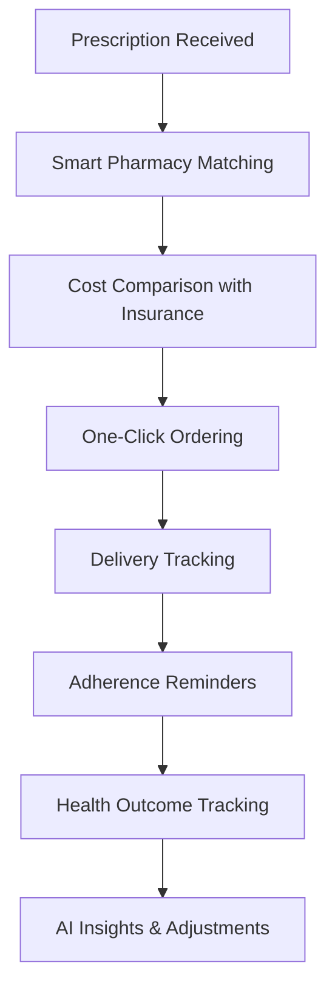
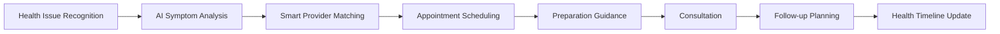

# MeddyPal UI/UX Transformation Roadmap
*Based on Manus AI Analysis and Current Implementation Review*

## Executive Summary

This roadmap implements the comprehensive UI/UX improvements identified in the Manus analysis, transforming MeddyPal from a feature-rich but complex platform into an intuitive, world-class healthcare experience.

## Current State Analysis

### Strengths
- ✅ Modern glass morphism design system
- ✅ Semantic color tokens with HSL implementation  
- ✅ Well-structured component architecture
- ✅ Responsive ModernCard system with variants
- ✅ Good TypeScript and React patterns

### Critical Issues (Manus Analysis Validated)
- 🔴 7-section navigation creates cognitive overload
- 🔴 Information fragmentation across disconnected sections
- 🔴 Complex user flows requiring multiple navigation steps
- 🔴 Information density overwhelms users
- 🔴 Missing progressive disclosure patterns
- 🔴 Accessibility gaps in navigation and interactions
- 🔴 Mobile navigation not optimized for healthcare contexts

## Implementation Phases

### Phase 1: Foundation & Navigation Redesign (Weeks 1-2)
**Priority: CRITICAL - Affects every user interaction**

#### 1.1 Three-Tier Navigation Architecture
Replace current 7-section sidebar with user-intent based structure:

**Current (Complex):**
```
Core (3 items)
Medical Services (6 items)  
AI Health Assistant (3 items)
Specialized Care (4 items)
Insights & Analytics (2 items)
Resources (2 items)
Administration (varies)
```

**New (Simplified):**
```
My Health (integrated personal health management)
Care & Services (unified healthcare interactions)
Insights & Tools (analysis and decision support)
```

#### 1.2 Mobile-First Navigation
- Bottom navigation bar for mobile (thumb-optimized)
- Collapsible sidebar with mini variant (w-14)
- Touch-optimized interactions
- Emergency quick access

#### 1.3 Contextual Navigation Integration
- Unified search across all sections
- Breadcrumb navigation consistency
- Smart back button with context preservation

### Phase 2: User Flow Integration (Weeks 3-4)
**Priority: HIGH - Eliminates workflow fragmentation**

#### 2.1 Integrated Medication Management
Connect currently disconnected features:
- Prescription → Pharmacy → Adherence → Outcomes
- Single workflow instead of 4 separate sections

#### 2.2 Appointment Ecosystem Integration  
- Scheduling → Preparation → Consultation → Follow-up
- Health data integration for appointment context
- AI assistance throughout workflow

#### 2.3 Contextual AI Assistant
- Remove AI chat from separate section
- Integrate AI help throughout platform
- Context-aware assistance based on current activity

### Phase 3: Information Architecture & Progressive Disclosure (Weeks 5-6)
**Priority: HIGH - Reduces cognitive load**

#### 3.1 Dashboard Personalization Engine
- Adaptive dashboard based on user behavior
- Progressive complexity revelation
- Role-based interface customization

#### 3.2 Information Layering System
- Summary → Details → Deep Analysis pattern
- Expandable sections with clear visual hierarchy
- Smart defaults with advanced options hidden

#### 3.3 Health Information Presentation
- Graduated medical information disclosure
- Plain language with technical details option
- Visual aids for complex concepts

### Phase 4: Accessibility & Inclusive Design (Weeks 7-8)
**Priority: MEDIUM - Ensures platform accessibility**

#### 4.1 Comprehensive Accessibility Implementation
- WCAG 2.1 AA compliance
- Screen reader optimization
- Keyboard navigation support
- High contrast modes

#### 4.2 Health Literacy Accommodation
- Multiple explanation levels for medical concepts
- Cultural sensitivity for Nigerian healthcare context
- Multilingual support preparation

#### 4.3 Motor & Cognitive Accessibility
- Voice input capabilities
- Simplified interaction modes
- Cognitive load reduction features

### Phase 5: Advanced Personalization (Weeks 9-10)
**Priority: MEDIUM - Enhances user experience**

#### 5.1 Adaptive Interface System
- Learning user preferences and patterns
- Interface complexity adjustment
- Personalized feature prominence

#### 5.2 Smart Recommendations Integration
- Contextual service suggestions
- Predictive healthcare needs
- Workflow optimization suggestions

## Technical Implementation Strategy

### Component Architecture Improvements

#### Enhanced ModernCard System
```typescript
// Extend current ModernCard with accessibility
interface ModernCardProps {
  variant: 'default' | 'elevated' | 'glass' | 'glass-strong' | 'gradient' | 'interactive'
  accessibility: {
    role?: string
    ariaLabel?: string
    keyboardNavigable?: boolean
  }
  progressive?: boolean // Enable progressive disclosure
}
```

#### New Navigation Components
```typescript
// Simplified navigation structure
interface NavigationSection {
  id: 'my-health' | 'care-services' | 'insights-tools'
  label: string
  description: string
  items: NavigationItem[]
  defaultExpanded?: boolean
}
```

### Design System Enhancements

#### Color System Improvements
```css
/* Healthcare-specific semantic tokens */
:root {
  /* Progressive disclosure indicators */
  --disclosure-available: hsl(var(--primary) / 0.1);
  --disclosure-active: hsl(var(--primary) / 0.2);
  
  /* Accessibility contrast ratios */
  --text-high-contrast: hsl(220 13% 5%);
  --bg-high-contrast: hsl(0 0% 100%);
  
  /* Mobile-optimized touch targets */
  --touch-target-min: 44px;
  --mobile-nav-height: 56px;
}
```

#### Accessibility Classes
```css
.keyboard-focus {
  @apply focus-visible:outline-none focus-visible:ring-2 focus-visible:ring-primary focus-visible:ring-offset-2;
}

.screen-reader-only {
  @apply sr-only;
}

.high-contrast-mode {
  @apply contrast-more:bg-background contrast-more:text-foreground;
}
```

### User Flow Mapping

#### Medication Management Integration


#### Appointment Ecosystem


## Success Metrics

### User Experience Metrics
- Task completion rate increase: Target 40%+ improvement
- Navigation efficiency: 50%+ reduction in steps for common tasks
- User satisfaction scores: Target 8.5/10 from current baseline
- Feature discovery rate: 60%+ improvement

### Healthcare-Specific Metrics
- Appointment completion rate improvement
- Medication adherence tracking engagement
- Preventive care compliance increase
- Healthcare provider satisfaction with platform data

### Technical Performance Metrics
- Page load time maintenance (<2s)
- Mobile performance optimization
- Accessibility compliance (WCAG 2.1 AA)
- Error rate reduction

## Implementation Timeline

### Week 1-2: Navigation Foundation
- [ ] Implement three-tier navigation architecture
- [ ] Create mobile-first navigation components  
- [ ] Integrate contextual search functionality
- [ ] Add proper breadcrumb navigation

### Week 3-4: Workflow Integration
- [ ] Connect medication management workflows
- [ ] Integrate appointment ecosystem components
- [ ] Implement contextual AI assistant
- [ ] Create unified service orchestration

### Week 5-6: Information Architecture
- [ ] Build progressive disclosure components
- [ ] Implement adaptive dashboard system
- [ ] Create information layering interfaces
- [ ] Add smart content prioritization

### Week 7-8: Accessibility Implementation
- [ ] WCAG 2.1 AA compliance implementation
- [ ] Screen reader optimization
- [ ] Keyboard navigation support
- [ ] High contrast mode development

### Week 9-10: Advanced Features
- [ ] Personalization engine development
- [ ] Smart recommendations integration
- [ ] Performance optimization
- [ ] Comprehensive testing and refinement

## Risk Mitigation

### User Adoption Risks
- **Gradual Migration**: Implement feature flags for progressive rollout
- **User Training**: Create interactive tutorials for new navigation
- **Feedback Loops**: Continuous user testing throughout implementation

### Technical Risks  
- **Backward Compatibility**: Maintain existing functionality during transition
- **Performance Impact**: Monitor and optimize during implementation
- **Data Integrity**: Ensure no data loss during workflow integration

### Healthcare Context Risks
- **Regulatory Compliance**: Maintain HIPAA/healthcare data protection
- **Clinical Accuracy**: Preserve medical information integrity  
- **Emergency Access**: Ensure emergency features remain accessible

## Long-term Vision

This transformation positions MeddyPal as the gold standard for healthcare platform UX in Africa, combining:

1. **Technical Sophistication** with **Intuitive Design**
2. **Comprehensive Features** with **Simple Workflows**  
3. **Advanced AI Capabilities** with **Human-Centered Interaction**
4. **Clinical Accuracy** with **Accessible Communication**

The result will be a platform that not only demonstrates technical leadership but also exemplifies user-centered design excellence in healthcare technology.

## Next Steps

1. **Review and Approve** this roadmap with stakeholders
2. **Begin Phase 1** implementation with navigation redesign
3. **Establish User Testing** protocols for continuous validation
4. **Create Component Library** documentation for consistency
5. **Set up Analytics** to measure improvement impact

---

*This roadmap transforms MeddyPal from a sophisticated but complex platform into an intuitive, world-class healthcare experience that matches its technical excellence with design excellence.*